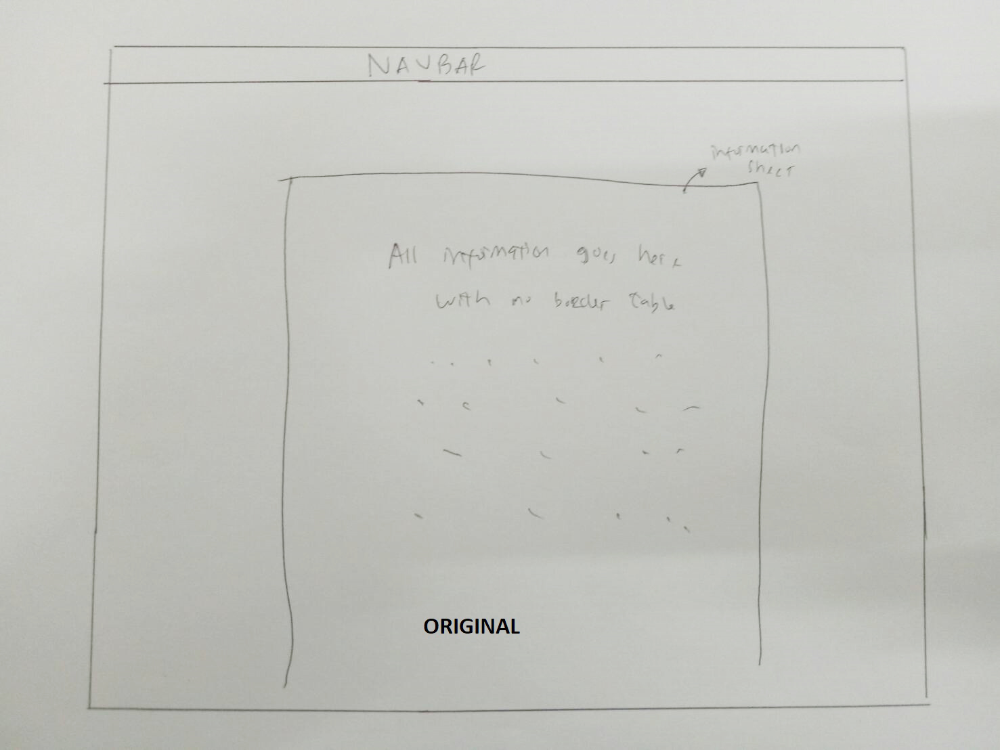
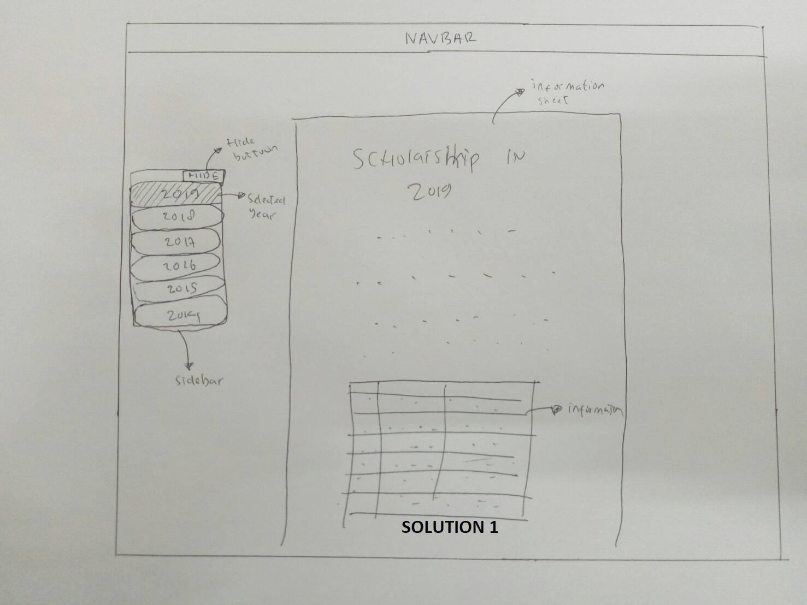
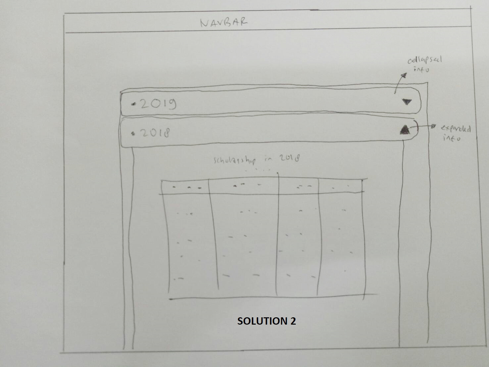
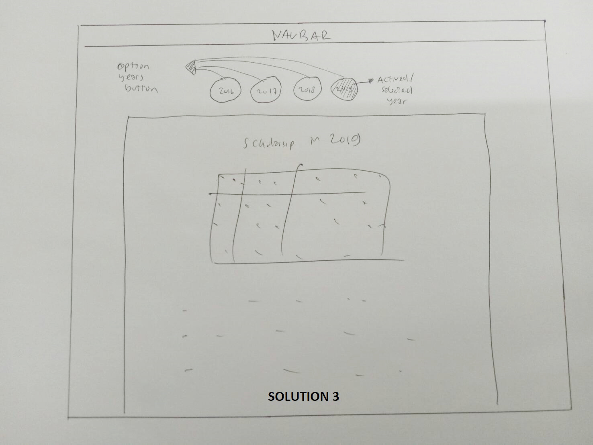

# Sketching and Prototyping
Using the information in the results of Assignment 1 for what is good and bad about the UI for designed tasks, we are going to make **Sketches** and **Prototypes**. These sketches and prototypes will lead to better design in Assignment 3. The prototypes will be then tested through a usability evaluation followed by design revision in Assignment 4.

## Part A: Sketches
Sketch at least **3 (three)** different UIs for the functions you are targeting. These three interfaces should be _dramatically different_ in terms of design directions. For example, they can be with different organizations of what functions on each screen or using a different layout of the icons, widgets, and menus on the screens. If you want, you can also incorporate non-on-screen UIs: physical buttons, gestures through motion sensors, etc.

You need **not** sketch the whole interface. It is not necessary for the sketches to have every function or every function in detail, but there should be enough to show off your general idea. **Be creative!** Draw your idea and label a few of the widgets so we can tell your intent. The goal is to have at least 3 good UIs in *interesting* ways. Sketches should be done on paper with pens and/or pencils (do not use a computer).

### 1. Scan/Photo of Sketches
##### 1.1 Original


##### 1.2 Solution 1


##### 1.3 Solution 2


##### 1.4 Solution 3


### 2. Version Differences
##### 2.1 Original
User receives **too much information** at once (Start from 2016 - 2019 ), no border line in table, and also no divider line between two information.
##### 2.2 Solution 1
There is a sidebar that holds several selection buttons for the year option, one selection only show you information for one year (eg: if you click button 2019, so the page only show you scholarship in only 2019), and on the top of sidebar the is a hidden button to show and hide your sidebar. And there is a border line for the table also the divider line between two information.

##### 2.3 Solution 2
There is a collapsable selection button for the year option, the method is if you click on 2019, so the other years(2018, 2017, 2016) will be collapsed and 2019 will be expanded. And there is a border line for the table also the divider line between two information.

##### 2.4 Solution 3
There is a navigation on the top of information sheet that contains selection button for the years option. And there is a border line for the table also the divider line between two information.

### 3. Selected Sketch
Among the three solution choices, i choose the **first solution**, because it can show or hide the side bar, and make the screen cleaner and efficient, and the other reason is wherever the scroll position is, you can change the information just by show the sidebar and change your choice of year. :smile:

### 4. Design Rationale
Based on contextual inquiry, i think the developer must position himself as a user, and if he feels it is difficult to access and take too much time to operate then that includes a bad design.

## Part B: Assumptions
### 1. Hardware
- Operating System : Windows or Linux
- Physical Input : Mouse and Keyboard
- Screen Resolution : 1024 x 768 or higher
- Screen Size : 15.6 inch
- Screen Color : RGB
- Computer with minimum requirements:
   - [Intel core 2 duo](https://en.wikipedia.org/wiki/Intel_Core#Core_2_Duo)
   - 2 GB Memory
### 2. Users
```
1. Familiar using computer and web browser.
2. Expected as ITS student.
```

## Part C: Prototypes
We will work on this part together during the class on **March 22nd, 2019**, 10:00 AM - 12.30 PM. Therefore, prior to the class please complete all the above parts (A & B) beforehand accordingly.
